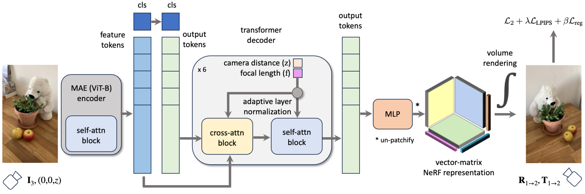

## NViST : In the Wild New View Synthesis from a Single Image with Transformers

CVPR 2024

[Wonbong Jang](https://wbjang.github.io/) and [Lourdes Agapito](https://scholar.google.com/citations?view_op=list_works&hl=en&hl=en&user=IRMX4-4AAAAJ&sortby=pubdate)

University College London

### [Paper](https://arxiv.org/abs/2312.08568) | [Project Page](https://wbjang.github.io/nvist_webpage) | [X (Twitter)](https://twitter.com/wbjang11/status/1765453564782997833)


NViST turns in-the-wild single images into implicit 3D functions with a single pass using Transformers.

## Methodology



We adopt a finetuned Masked Autoencoder (MAE) to generate self-supervised feature tokens and a class token. 
Our decoder, conditioned on normalized focal lengths and camera distances via adaptive layer normalisation, 
translates feature tokens to output tokens via cross-attention, and reasons about the occluded region through self-attention.
We use a vector-matrix representation to encode the radiance fields. 

## Setting up an environment

```sh 
conda create -n nvist python=3.9
conda activate nvist
pip install torch torchvision torchaudio --index-url https://download.pytorch.org/whl/cu118
pip install tqdm scikit-image opencv-python configargparse lpips imageio-ffmpeg lpips tensorboard torch_efficient_distloss
pip install easydict timm plyfile matplotlib kornia accelerate
```

This code is tested for Pytorch 2.1.2 with CUDA 11.8.
We use [Nerfies](https://github.com/google/nerfies) to retrieve COLMAP information.

```sh
pip install tensorflow pandas
pip install git+https://github.com/google/nerfies.git@v2
pip install "git+https://github.com/google/nerfies.git#egg=pycolmap&subdirectory=third_party/pycolmap"
```


## Dataset

Download MVImgNet dataset from this [official repository](https://github.com/GAP-LAB-CUHK-SZ/MVImgNet).
Highly recommend to use [Tip](https://docs.google.com/document/d/1krVb4B3rZw-0FaBBPS7c3SJKfqq5AVYTs2HN2LnlBPQ/edit#heading=h.2ukfzxh5c9pq) provided by the authors.

For the paper, we use the subset of MVImgNet - 1.14M frames, 38K scenes of 177 categories for training, and for testing, a total of 13,228 frames from 447 scenes and 177 categories are used. 


### Pre-process the dataset

In this paper, we downsample the images by 12, and we use portrait images having 160x90 for training. 
We made a cache for the dataset. 

* Unzip files. In my case, unzip files in '../../data/mvimgnet' (data_dir)
* Downsample images by 12 

```sh
python -m preprocess.downsample_imgs --data_dir ../../data/mvimgnet 
```

* Retrieve camera poses : We retrieve camera poses, and boundary of point clouds from COLMAP results. We follow OpenCV convention.

```sh
python -m preprocess.read_colmap_results_mvimgnet
```

* Make Cache files 

```sh
python -m preprocess.make_cache --data_dir ../../data/mvimgnet
python -m preprocess.make_cache --data_dir ../../data/mvimgnet --split test
```

Please get in touch with [me](mailto:won.jang1108@gmail.com) if you need the processed dataset.

## Train NViST

### Fine-tuning MAE dataset

Fist, download the pre-trained MAE from the official [MAE repository](https://github.com/facebookresearch/mae) or use this command below.

```sh
mkdir pretrained
cd pretrained
wget -nc https://dl.fbaipublicfiles.com/mae/visualize/mae_visualize_vit_base.pth
```

Then, run this command for fine-tuning.

```sh
accelerate launch --mixed_precision=fp16 scripts/train_mae.py --config configs/mvimgnet_mae.txt --apply_minus_one_to_one_norm False --expname mae_mvimgnet_imgnet
```

### Training NViST

We support multi-GPUs operation using accelerate. Both batch size (number of images for encoder) and batch pixel sizes (number of pixels we use for rendering) are for 40GB A100 GPUs. Increase the learning rate by $\sqrt{N}$ if you increase your batch size and batch pixel size by $N$.

```sh

CUDA_VISIBLE_DEVICES=0 accelerate launch --mixed_precision=fp16 scripts/train_nvist.py --config configs/mvimgnet_nvist.txt\
 --batch_size 11 --batch_pixel_size 165000 --expname nvist_mvimgnet_1gpu

accelerate launch --mixed_precision=fp16 scripts/train_nvist.py --config configs/mvimgnet_nvist.txt\
 --batch_size 22 --batch_pixel_size 330000 --expname nvist_mvimgnet_2gpus --lr_encoder_init 0.00006 --lr_decoder_init 0.0003 --lr_renderer_init 0.0003

```


### Inference the pre-trained NViST

```sh
CUDA_VISIBLE_DEVICES=0 python scripts/eval_nvist.py --config <config_path> --ckpt_dir <ckpt_path>
```


## Acknowledgement

The research presented here has been partly supported by a sponsored research award from Cisco Research. This project made use of time on HPC Tier 2 facilities Baskerville (funded by EPSRC EP/T022221/1 and operated by ARC at the University of Birmingham) and JADE2 (funded by EPSRC EP/T022205/1). We are grateful to Niloy Mitra and Danail Stoyanov for fruitful discussions.


Some parts of our code are adapted from below GitHub Repositories.

[timm](https://github.com/huggingface/pytorch-image-models)

[MAE](https://github.com/facebookresearch/mae)

[TensoRF](https://github.com/apchenstu/TensoRF)

[Nerfies](https://github.com/google/nerfies)

[DiT](https://github.com/facebookresearch/DiT) 

[BARF](https://github.com/chenhsuanlin/bundle-adjusting-NeRF)

## Citation

If you find our work useful in your research, please consider citing our paper.

```sh
@article{jang2023nvist,
    title={NViST: In the Wild New View Synthesis from a Single Image with Transformers}, 
    author={Wonbong Jang and Lourdes Agapito},
    year={2023},
    eprint={2312.08568},
    archivePrefix={arXiv},
    primaryClass={cs.CV}
}
```
